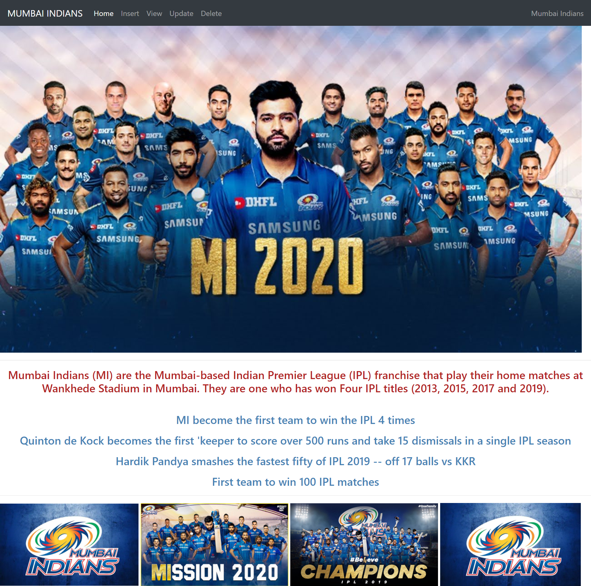
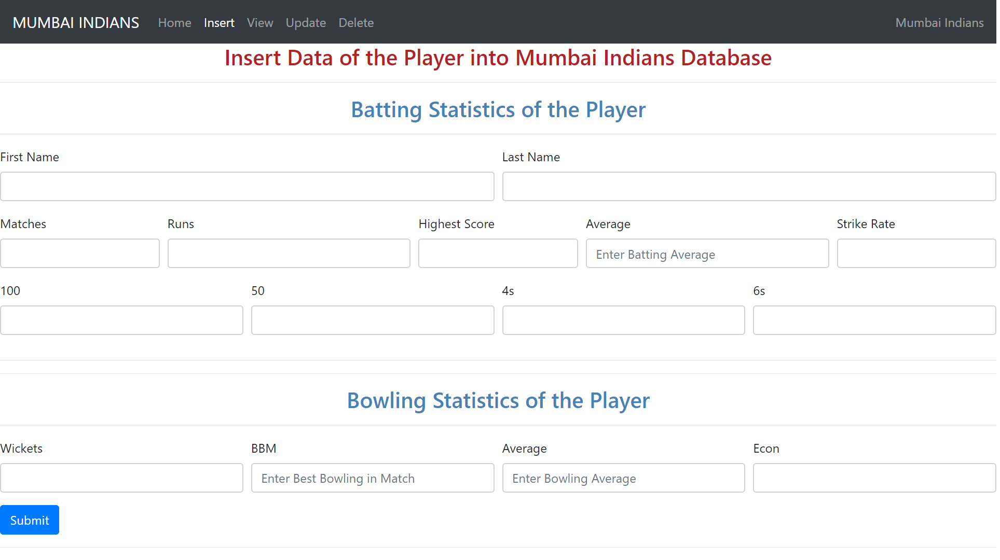
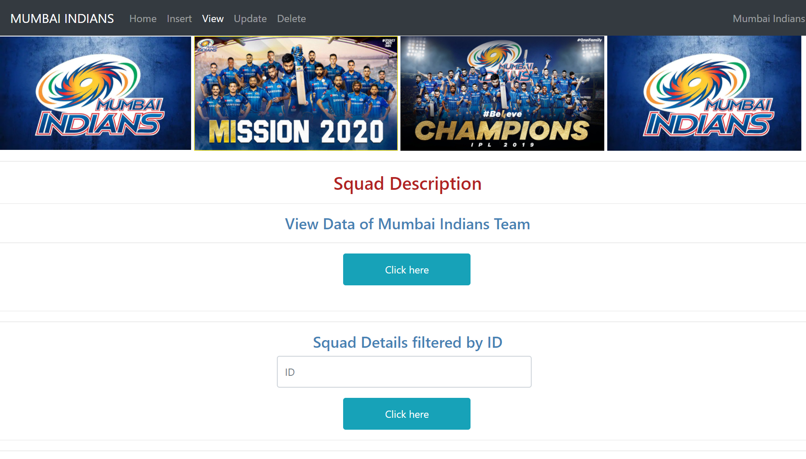
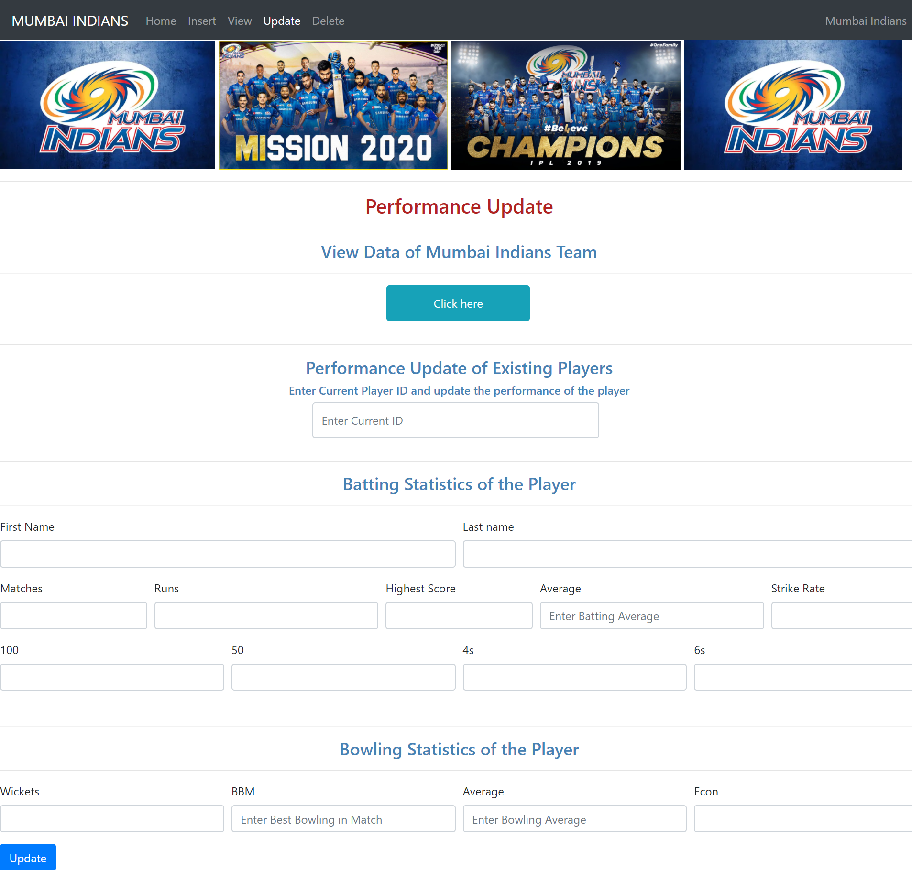
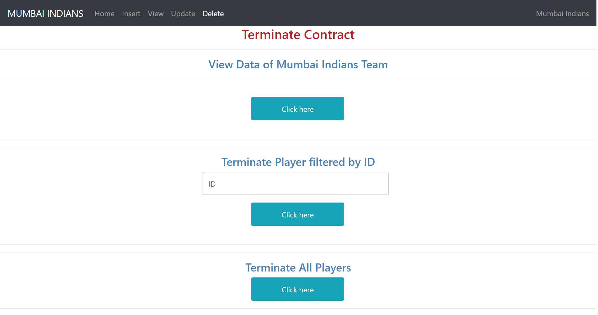

## IPL CRUD PORTAL

This project involves the creation of an HTML web form linked to a MariaDB database using PHP server-side scripting. It includes performing CRUD (Create, Read, Update, Delete) operations on the form. Additionally, the project encompasses the creation of a virtual instance on AWS EC2, the installation of a LAMP stack, and the hosting of the site and database on the AWS EC2 instance.

### Tools Used

Frontend: HTML, CSS
Backend: PHP7, PHP-MySQLi extension
Database: MariaDB 10.4.11
Cloud: AWS EC2

### Procedure

Developed HTML pages, including index.html, insert.php, view.php, update.php, and delete.php, to create the user interface.
Executed CRUD operations (Insert, Select, Update, Delete) by writing SQL queries for each operation.
Linked all the HTML pages with PHP to enable server-side processing.
Established a connection between PHP and the MariaDB database.
Initially, the project was tested on localhost using Xampp to ensure proper functionality.
Subsequently, the database was linked to an AWS cloud server for hosting.
MobaXterm was utilized as a client to access the AWS cloud server Database.
This project serves as a practical example of how to create a web-based CRUD portal and host it on AWS EC2, making it accessible to users via the internet.

### Output
- 
- 
- 
- 
- 

